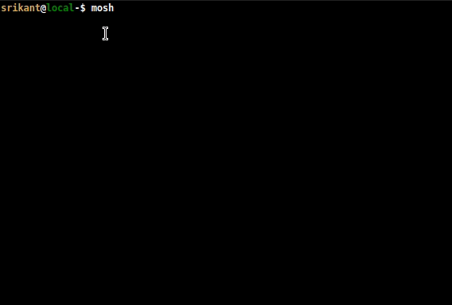

Working on remote systems could be challenging if your connection is spotty. Especially when you're using a remote shell. 
I use more than one connection to the same server, and reconnecting each broken session is frustrating. 

I know `mosh`, an excellent in-place replacement for `ssh`. However, you need an additional `UDP` port for each
session. Then comes the `tmux`, a screen splitter, and a session manager with extra goodies. But I prefer `byobu`, which is 
a wrapper around `tmux` which in turn is a wrapper around GNU `screen`. 
The `byobu` split screen keyboard shortcuts work out of the box, it has a somewhat fancier status bar too. 

To get started, on deb based system, on the `remote server` run
``` bash
sudo apt install -y mosh byobu
```
Check your firewall settings on the server, and ensure the `mosh` UDP port is open. The port number starts from
`60001`.
```bash
sudo netstat -punta | grep mosh
```

Install mosh on the `local machine` as well
```bash
sudo apt install -y mosh
```

Now, simply connect to the `remote server` as
```bash
mosh user@server byobu
```

A GIF for no reason. 



The mosh connects automatically when a connection resumes (not shown in the above demo though), and the 
byobu maintains the session. 

Hope this worked for you. 
Any queries, please raise an issue on the Github page.